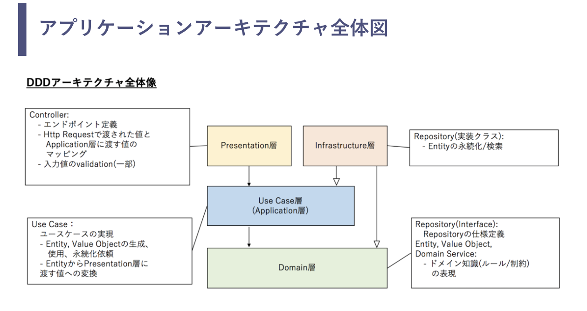

2021-05-07 03:18:24

# todo
- [x] リリースボットのバックエンドの設計作成
- [x] mysql とつなぐ(query builder や orm は使わない)
- [ ] table 設計
- [ ] api 作成
- [ ] ビジネスロジック作成

# design: release bot backend
https://jamboard.google.com/d/1iG2a7babnIvacjrJc7Djjt8CKxsNW1BY6_noTYcrNno/edit?usp=sharing

cf. [新卒にも伝わるドメイン駆動設計のアーキテクチャ説明\(オニオンアーキテクチャ\)\[DDD\] \- little hands' lab](https://little-hands.hatenablog.com/entry/2018/12/10/ddd-architecture)

## table
user
- user_id
- name
- count
- release_state
- number

# 参考
- [Deno\+MySQL\+DockerでAPIサーバーをさくっと作る \- Qiita](https://qiita.com/rydein/items/1051e5d161fb407b939b)
- [Build and Dockerize a Blogging API With Deno, Oak, and MySQL \| by Farhan Hasin Chowdhury \| Better Programming](https://betterprogramming.pub/build-and-dockerize-a-blogging-api-with-deno-oak-and-mysql-f2e4ecafaf6c)
- [4ステップで作成する、DB論理設計の手順とチェックポイントまとめ \- Qiita](https://qiita.com/nishina555/items/a79ece1b54faf7240fac)
